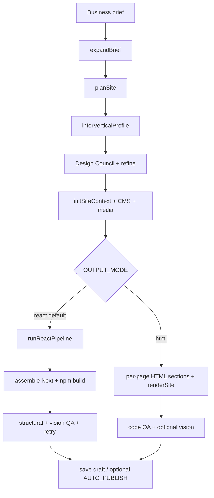
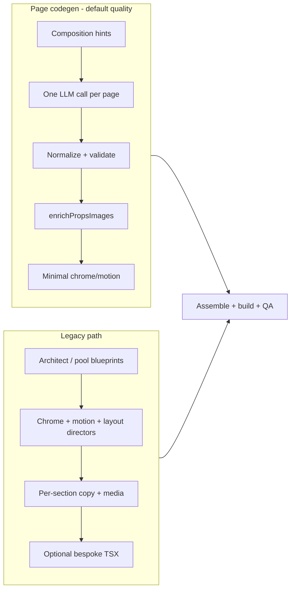

# Website Generator — System Documentation

In-depth reference for how this repository turns a short business brief into a multi-page marketing website (React/Next.js static export by default, or legacy HTML). This document describes architecture, pipelines, agents, templates, design, media, QA, LLM controls, hosting, and how the pieces fit together.

---

## Table of contents

1. [Purpose and mental model](#1-purpose-and-mental-model)
2. [Repository layout](#2-repository-layout)
3. [Entry points and CLI](#3-entry-points-and-cli)
4. [End-to-end generation flow](#4-end-to-end-generation-flow)
5. [Core types and site context](#5-core-types-and-site-context)
6. [Two React generation paths](#6-two-react-generation-paths)
7. [Page-codegen pipeline (default quality)](#7-page-codegen-pipeline-default-quality)
8. [Legacy architect + section-fill pipeline](#8-legacy-architect--section-fill-pipeline)
9. [Agents catalog](#9-agents-catalog)
10. [Section templates and component library](#10-section-templates-and-component-library)
11. [Design system](#11-design-system)
12. [Media and images](#12-media-and-images)
13. [React codegen, build, and preview](#13-react-codegen-build-and-preview)
14. [HTML legacy path](#14-html-legacy-path)
15. [QA and vision retry](#15-qa-and-vision-retry)
16. [LLM client, models, budgets, and speed modes](#16-llm-client-models-budgets-and-speed-modes)
17. [Hosting and export](#17-hosting-and-export)
18. [Playground UI](#18-playground-ui)
19. [Environment variables and flags](#19-environment-variables-and-flags)
20. [Testing](#20-testing)
21. [Operational notes and failure modes](#21-operational-notes-and-failure-modes)

---

## 1. Purpose and mental model

**What it is:** A multi-agent website generator. Input is a free-text business brief (and optional variation seed). Output is a multi-page marketing site with shared nav/footer, design tokens, stock/curated images, and optional publish to storage/CDN.

**What it is not:** A general-purpose website builder with a free-form page editor as the primary path. Generation is constrained to a **fixed React section component library** whose props are Zod-validated. “Creativity” means choosing section types, writing copy, picking layouts within templates, and varying seed-driven design — not inventing arbitrary DOM.

**Three separations:**

| Layer | Responsibility |
|--------|----------------|
| **Content** | Headlines, body, CTAs, list items, FAQs |
| **Composition** | Which section components appear, in what order, with what roles |
| **Design tokens** | Colors, fonts, nav treatment, motion presets, chrome (footer/nav extras) |

**Default path today (quality + React):** after brief expansion, site plan, and design system, **one LLM call per page** chooses components and fills props (`page-codegen`). Images are resolved deterministically. A Next.js 14 static export is assembled and built. Structural + vision QA may trigger targeted retries. Result lands under `output/` and can be previewed in the playground or published.

---

## 2. Repository layout

```
website-generator/
├── src/
│   ├── cli.ts                    # CLI entry
│   ├── index.ts                  # Public re-exports
│   ├── load-env.ts               # .env bootstrap (override: true)
│   ├── types.ts                  # Shared Zod/TS contracts
│   ├── orchestrator/             # generateSite + React/HTML pipelines + vision retry
│   ├── agents/                   # All LLM (and related) agents
│   ├── section-templates/        # Registry, Zod schemas, prop repair
│   ├── react-codegen/            # Assemble Next project + component-library/
│   ├── design/                   # Profiles, seeds, blueprint pools, trim/repair
│   ├── theme/                    # Contrast QA, profile coherence
│   ├── motion/                   # Motion presets
│   ├── media/                    # Image providers, stock helpers, media registry
│   ├── llm/                      # Client, models, budgets, queues, speed modes
│   ├── qa/                       # Structural, design, vision routing
│   ├── renderer/                 # HTML path renderer
│   ├── site-context/             # initSiteContext, page assembly helpers
│   ├── hosting/                  # Supabase publish, slug, cleanup
│   ├── web/                      # Playground Express server + static UI
│   ├── export/                   # Project/Webflow-ish export formats
│   ├── editor/                   # Session + re-render for playground editing
│   ├── cms/                      # Optional CMS collections for generated sites
│   ├── server/                   # Static preview helpers
│   └── util/                     # Pools, logging, timed steps, LLM required, etc.
├── tests/                        # Vitest suite
├── scripts/                      # Hosting, cost estimate, provider smoke tests
├── supabase/                     # Migrations + serve-site edge function
├── output/                       # Generated sites (gitignored typically)
└── docs/SYSTEM.md                # This file
```

---

## 3. Entry points and CLI

| Entry | Path | Role |
|--------|------|------|
| CLI | `src/cli.ts` | `playground` / `ui`, `generate` / `dev`, `preview` |
| Orchestrator | `src/orchestrator/orchestrator.ts` | `generateSite()` |
| React pipeline | `src/orchestrator/react-pipeline.ts` | Next/Framer-parity generation |
| Playground | `src/web/playground-server.ts` + `src/web/public/` | UI on ~3847, live logs, preview |
| Env | `src/load-env.ts` | Loads `.env` so file values win over shell |

**npm scripts (from `package.json`):**

- `npm run playground` / `ui` / `start` — Playground UI
- `npm run generate` / `dev` — CLI generation
- `npm run preview` — Serve static output
- `npm test` — Vitest
- Hosting: `hosting:check`, `hosting:local`, `hosting:pages`, `supabase:deploy-site`
- `estimate:cost` — Cost estimation helper

**Typical output directories:**

| Path | Use |
|------|-----|
| `output/<slug>/` | CLI HTML (or related) site output |
| `output/_playground/` | Playground HTML-ish preview |
| `output/_playground-react/` | Generated Next project; static site in `out/` |
| `output/_debug/<slug>/…` | Optional debug artifacts |

---

## 4. End-to-end generation flow

High-level React default:



### Stage details (orchestrator)

1. **Expand brief** (`expand-brief-agent`) → `ExpandedBrief` (businessName, tagline, elevator pitch, services, audience, tone, CTAs, long expanded brief).
2. **Plan site** (`site-planner-agent`) → `SitePlan`: pages (slug, title, goal, layoutHint, contentFocus), compositionStrategy, avoidPatterns, visualArchetype, industryFamily.
3. **Vertical profile** (`vertical-profiles`) — one of: `luxury-dark`, `clinical-light`, `corporate-light`, `editorial-light`, `warm-consumer`. Influences palette hints, typography hints, nav treatment bias, motion, hero bias (legacy), copy/image hints.
4. **Variation seed** — Deterministic diversity key. Quality mode often derives from a random UUID hash; can be set from playground. Used for palette drifts, blueprint pool picks, composition hints.
5. **Design system** — Design Council in parallel: palette + typography + nav surface → merge → optional design refine → design/token QA (contrast).
6. **SiteContext** — Runtime bag holding brief, plan, theme, profiles, seed, pages/reactPages, chrome/motion/layout plans, media registry, CMS, QA history.
7. **Branch:** `OUTPUT_MODE=react` (default) → `runReactPipeline`; `html` → HTML section builders + `renderer`.
8. **Build / serve / fallback** — React: assemble library + write pages → `npm install` + `npm run build` → serve `out/` (or HTML preview fallback if build fails).
9. **QA** — Blueprint/chrome/motion/layout (when applicable), React structural QA, vision QA with optional retry loops.
10. **Persist / publish** — Draft site context in Supabase when configured; `AUTO_PUBLISH` uploads static files.

---

## 5. Core types and site context

Primary definitions live in `src/types.ts`.

| Type | Meaning |
|------|---------|
| `ExpandedBrief` | Structured briefing from free-text brief |
| `SitePlan` / `PagePlan` / `SectionPlan` | IA: pages, goals, content focus, optional section plans |
| `SiteTheme` | Design tokens: colors (bg/surface/text/muted/accent/gradients/nav*), fonts, mood, radius, spacing |
| `SiteContext` | Full generation state for a run |
| `PageBlueprint` | Slug + rhythm + list of `{ id, templateId, intent }` |
| `SectionInstance` | Filled section: `props`, motion, optional layoutSpec, optional `customCodegen` |
| `ReactPage` | `{ slug, title, navLabel?, sections: SectionInstance[] }` |
| `ChromeSpec` | Footer layout, nav scroll, announcement, sticky CTA, newsletter, grain, smooth scroll |
| `SiteMotionPlan` | Global + per-section motion |
| `SiteLayoutPlan` | Per-section layout variants / density / media position |
| `ContentBlock` / `LayoutNode` / `PageSpec` | HTML-pipeline content & layout trees |
| `GenerationResult` | Final bundle: HTML/paths, QA, costs, publish metadata |
| `QAIssue` / `QAResult` | `hard` \| `soft` severity |

`initSiteContext` (`src/site-context/assemble.ts`) creates the initial context. Later stages mutate it (`reactPages`, `chromeSpec`, `mediaRegistry`, etc.).

---

## 6. Two React generation paths

Controlled by `usePageCodegenPipeline()` in `src/llm/pipeline-speed.ts`:

| Condition | Page codegen |
|-----------|----------------|
| Quality pipeline (default) | **ON** |
| `PIPELINE_PAGE_CODEGEN=1` | Force ON |
| `PIPELINE_PAGE_CODEGEN=0` | Force OFF (legacy) |
| Fast pipeline | OFF unless forced ON |



---

## 7. Page-codegen pipeline (default quality)

**Intent:** Fewer LLM round-trips; one strong model (page role, typically Claude Sonnet via OpenRouter) composes each page’s section list + props in one JSON response. Site architect, per-section fill, and chrome/motion/layout directors are skipped.

### Key files

| File | Role |
|------|------|
| `src/agents/page-codegen-agent.ts` | Prompt, LLM call, retries, image enrich, instances |
| `src/agents/page-codegen-normalize.ts` | Structural prop repair, alias coalescing, section trim |
| `src/agents/page-codegen-validate.ts` | Length rules, required props, banned components, placeholder copy |
| `src/agents/page-composition-hints.ts` | Seeded per-page hero + avoid/encourage |
| `src/agents/component-manifest.ts` | Compact per-page palette for the prompt (no example props dump) |
| `src/agents/minimal-site-chrome.ts` | Non-LLM chrome/motion defaults |
| `src/orchestrator/react-pipeline.ts` | Orchestrates parallel page codegen |

### Composition hints (anti-sameness)

Before parallel page calls, `buildSiteCompositionPlan(ctx)` uses `variationSeed` (or business name) to:

- Assign a **different hero** per page when possible (`HeroEditorial`, `HeroSplitCinematic`, `HeroSpotlight`, `HeroVideo`)
- Allow rare/repetitive types (`FaqAccordion`, `StatsMarquee`, `IntroStatement`, …) on **at most one** page
- Per-page **encourage** / **avoid** lists
- Pass sitePlan `avoidPatterns` and page `contentFocus` / `layoutHint` into the user prompt

Validation can require the assigned hero and reject banned components.

### Prompt discipline

- Manifest is **page-scoped** and lists only `componentName: description` (no “when to use FAQ” bias, no example props that anchor layout).
- Rules: inner pages 3–5 sections, home 4–7; one conversion closer; images as `{ alt }` only (never raw `src` from the LLM).
- Temperature ~0.85; validation failures retry up to 3 times with the error echoed back.

### Normalization before validation

`preparePageCodegenPlan`:

1. Map aliases (`title` → `headline`, `number` → stats `value`, `services` → `paragraphs`, contactInfo flatten, portfolio projects ↔ slides, etc.)
2. Coalesce missing headlines from title/label/**section intent**
3. **Trim** pages with too many sections (prefer keeping opener + closer)
4. `repairTemplateProps` for schema-shaped gaps

Salvage: after failed retries, a repaired candidate may still be accepted (with requiredHero relaxed) so one flaky page does not kill the whole run when structurally recoverable.

### Images after plan acceptance

`enrichPropsImages` starts from **real props** (not `{}`), walks `TEMPLATE_IMAGE_FIELDS`, resolves `https://` URLs via stock providers into image objects, then continues to assemble.

### Assemble-time props

`propsForCodegen` in `assemble-project.ts` sanitizes props (strips `imageQuery`). If media is already resolved (`https://` src present), it avoids destructive re-normalization that would wipe images.

---

## 8. Legacy architect + section-fill pipeline

Used when `PIPELINE_PAGE_CODEGEN=0` (or fast mode without force).

### Structure

1. **Creative director / site architect** — LLM (or blueprint pools in fast mode) picks `templateId` sequences per page.
2. **Blueprint QA + repair** — `blueprint-qa`, `repairBlueprints`, pools, trim/enforce helpers.
3. **Directors (parallel):**
   - Chrome director — footer/nav extras, grain, announcement (often opt-in / reduced bias)
   - Motion director — `SiteMotionPlan`
   - Layout director — per-section layout variants
4. Optional director QA retries (skipped in fast).
5. **Section fill** — concurrent `fillSectionProps`: copywriter + media curator (quality) or unified section LLM (fast).
6. Optional **bespoke section codegen** (`BESPOKE_SECTION_CODEGEN=1`) — LLM writes custom TSX; build failures drop custom files back to templates.
7. Page composer → `finishReactPipeline` (same assemble/build/QA finish as page-codegen).

### Blueprint pools

`src/design/blueprint-pools.ts` — curated sequences per vertical/profile and page slug. Used for fast path and repair. Selected with `variationSeed` via `pickFrom`.

### Why page-codegen exists

The legacy stack chained many LLM roles (architect + N × section fill + directors). It was expensive, slow, and still prone to “same hero / same FAQ” because pools and director prompts leaked defaults. Page-codegen consolidates composition into one call and adds seeded composition hints.

---

## 9. Agents catalog

### Planning and brief

| Agent | File | Job |
|--------|------|-----|
| Expand brief | `expand-brief-agent.ts` | Free text → `ExpandedBrief` |
| Site planner | `site-planner-agent.ts` | Pages, goals, layout/content hints, composition strategy |
| Theme (legacy) | `theme-agent.ts` | Fallback / older theme paths |

### Design Council

| Agent | File | Job |
|--------|------|-----|
| Design director | `design-director-agent.ts` | Parallel palette + typography + nav → merged theme |
| Palette | `palette-agent.ts` | Colors, mood, accents (seeded drift) |
| Typography | `typography-agent.ts` | Fonts, scale cues |
| Nav surface | `nav-surface-agent.ts` | Nav colors / treatment (solid/minimal preferred over glass) / nav **shape** (full-width, floating-capsule, floating-panel, split-inline) |
| Design refine | `design-refine-agent.ts` | Contrast / coherence pass |
| Merge design | `merge-design.ts` | Assemble final `SiteTheme` |

### Structure (legacy React)

| Agent | File | Job |
|--------|------|-----|
| Creative director | `creative-director-agent.ts` | Blueprint entry; quality → architect |
| Site architect | `site-architect-agent.ts` | Template sequences |
| Chrome director | `chrome-director-agent.ts` | ChromeSpec |
| Motion director | `motion-director-agent.ts` | SiteMotionPlan |
| Layout director | `layout-director-agent.ts` | SiteLayoutPlan |
| Minimal chrome | `minimal-site-chrome.ts` | Page-codegen chrome/motion without LLM |

### Section fill (legacy)

| Agent | File | Job |
|--------|------|-----|
| Section props | `section-props-agent.ts` | Orchestrates copy + media |
| Copywriter | `copywriter-agent.ts` | Text-only props |
| Media curator | `media-curator-agent.ts` | Image fields + `enrichPropsImages` |
| Section unified | `section-unified-agent.ts` | Copy+media in one call (fast) |
| Polish / merge | `polish-section-props.ts`, `merge-props.ts` | Post-process |
| Section codegen | `section-codegen-agent.ts` | Bespoke TSX |
| Page composer | `page-composer-agent.ts` | Blueprint + instances → ReactPage |

### Page codegen

| Agent | File | Job |
|--------|------|-----|
| Page codegen | `page-codegen-agent.ts` | Full-page JSON composition |
| Normalize / validate / hints / manifest | `page-codegen-*.ts`, `page-composition-hints.ts`, `component-manifest.ts` | As in §7 |

### HTML / content path

| Agent | File | Job |
|--------|------|-----|
| Section builder | `section-builder-agent.ts` | HTML sections |
| Content | `content-agent.ts` | Content blocks |
| Composition | `composition-agent.ts` | Layout trees (`Stack`/`Row`/`Grid`/…) |
| Content / layout normalize | `content-normalize.ts`, `layout-normalize.ts` | Repair |
| Fix / layout fix | `fix-agent.ts`, `layout-fix-agent.ts` | QA-driven patches |

### Vision and shared

| Agent | File | Job |
|--------|------|-----|
| Vision | `vision-agent.ts` | Multimodal QA from screenshots |
| Catalog | `component-catalog.ts` | Prompt mandates for library usage |
| Contracts | `contracts/` | Snapshots, validation helpers, motion attach |

---

## 10. Section templates and component library

### Registry

`src/section-templates/registry.ts` — each template has:

- `id` (snake_case template id, e.g. `feature_bento`)
- `componentName` (PascalCase React export, e.g. `FeatureBento`)
- Zod `propsSchema`
- `sectionMode`: `bleed` | `contained` | `editorial` | `band`
- Default motion
- Allowed pages (`home`, `about`, …, `any`)

**Supporting:** `schemas.ts` (Zod), `repair-props.ts` (pad/coerce), `hero-variants.ts`.

### Template inventory (approx. 27)

Heroes: `hero_editorial`, `hero_split_cinematic`, `hero_video`, `hero_spotlight`  
Content: `intro_statement`, `services_showcase`, `feature_bento`, `scroll_showcase`, `text_marquee`  
Proof: `stats_marquee`, `stats_animated`, `testimonial_featured`, `testimonial_carousel`, `logo_marquee`, `before_after`  
Portfolio: `portfolio_strip`, `portfolio_carousel`, `gallery_masonry`, `horizontal_gallery`, `team_grid`  
Commerce / convert: `pricing_tiers`, `pricing_toggle`, `faq_accordion`, `cta_band`, `footer_cta`, `newsletter_band`, `contact_split`

Premium subset (`PREMIUM_TEMPLATE_IDS`) favors immersive heroes/galleries/carousels where design quality matters most.

### React implementations

`src/react-codegen/component-library/components/sections/`

- `index.tsx` — core sections
- `premium.tsx` — spotlight, scroll showcase, horizontal gallery
- `immersive.tsx` — video hero, carousels, before/after, animated stats, newsletter

**Primitives:** `Container` (content rail), `Reveal` / `Stagger`, `Media`, layout helpers (`SplitHeroLayout`, `CardGrid`, `BentoGrid`).

**Layout sizing:** `cardGridClassForCount(n)` sizes grids by **item count** so 2 cards do not sit in a 4-column track. FeatureBento uses larger aspect ratios, padding, and optional default spans.

**Chrome:** `SiteNav`, `SiteFooter`, announcement/sticky CTA, `MotionProvider`, `SmoothScroll`.

---

## 11. Design system

| Concern | Path |
|---------|------|
| Vertical profiles | `src/design/vertical-profiles.ts` |
| Variation helpers | `src/design/variation.ts` (`hashString`, `pickFrom`, `pickIndex`) |
| Seeded palette/fonts | `src/design/seed-design.ts` |
| Blueprint pools | `src/design/blueprint-pools.ts` |
| Brief intent | `src/design/brief-intent.ts` |
| Enforce / trim / repair blueprints | `enforce-blueprint.ts`, `blueprint-trim.ts`, `blueprint-repair.ts` |
| Contrast | `src/theme/contrast.ts` |
| Profile coherence | `src/theme/profile-coherence.ts` |
| Motion presets | `src/motion/presets.ts` |

**Profiles** bind industry families to page tone (dark/warm/light/cool), nav treatment, motion preset, palette/typography/copy/image hints. Site plan `visualArchetype` can override aspects.

**Single React path:** page-codegen only. The legacy architect / per-section fill pipeline was removed. Design council → site visual contract (`resolveSiteVisualContract`) → composition plan → typed page acceptance → chrome/motion → assemble → generated-project typecheck+build.

**Anti-template bias in design:** glass/grain nav treatments were dialed down; LLM `navTreatment` is preserved by coherence helpers instead of being overwritten to glass defaults. Page-codegen mode avoids chrome directors that reintroduced grain/blur.

**Nav shape is an LLM decision, not a hardcoded rotation.** `nav-surface-agent.ts` chooses a `navShape` alongside `navTreatment`/colors: `full-width` (classic edge-to-edge bar), `floating-capsule` (single rounded-pill bar inset from the viewport edges), `floating-panel` (softer rounded-rectangle floating bar), or `split-inline` (logo and links render as two independent floating pills with a gap between them). The prompt describes what each shape *reads* like (formal vs. modern vs. warm vs. design-forward) and which brand personalities suit it, then asks the model to choose — it is never picked by a seeded pool. `SiteTheme.navShape` flows through `merge-design.ts` → `profile-coherence.ts` (preserved, not overwritten) → `assemble-project.ts` (passed as a prop on `<SiteNav navShape=... />`). `SiteNav.tsx` and the pure `nav-shape.ts` helper turn that single value into the actual layout: which container gets the rounded/pill classes, whether logo and links split into two surfaces, and where the nav-treatment background (`data-nav-treatment` → `.nav-surface` in `globals.css`) gets applied. Vertical profiles only supply a *prior* (e.g. editorial leans `split-inline`, clinical leans `full-width`) that the LLM is explicitly told it can override.

**CSS tokens:** Generated CSS variables from `SiteTheme` (`--color-bg`, `--color-accent`, `--max-content`, section gaps, etc.) in the component library `globals.css`.

**`radiusScale` / `shadowDepth` are real theme tokens components must consume via CSS vars, not literal Tailwind classes.** The typography agent picks `radiusScale: sharp|soft|rounded|pill` and `shadowDepth: flat|soft|elevated|dramatic` per brand; `assemble-project.ts` compiles them into two CSS custom properties: `--radius` (buttons, chips, form fields, small pills — `radiusValue()`) and `--radius-lg` (cards, panels, large media — `radiusLgValue()`, which never collapses a big rectangular surface into a literal 9999px stadium even at `pill`), plus `--shadow` (`shadowValue()`). Every section/button/card in `src/react-codegen/component-library/components/**` must use `rounded-[var(--radius)]`, `rounded-[var(--radius-lg)]`, and `shadow-[var(--shadow)]` — never a literal `rounded-full` / `rounded-xl` / `rounded-2xl` / `shadow-xl` / `shadow-2xl`. An earlier audit found the vast majority of CTA buttons, form fields, hero/gallery/team images, and cards across `sections/index.tsx`, `sections/immersive.tsx`, `sections/premium.tsx`, `SiteFooter.tsx`, `StickyMobileCta.tsx`, and `nav-shape.ts` hardcoded literal radius/shadow classes that silently ignored the brand's `radiusScale`/`shadowDepth` choice — every site rendered the same pill buttons and the same rounded-2xl cards regardless of brief. This was fixed by routing all of them through the two radius vars and the shadow var. Exceptions that intentionally stay literal `rounded-full`: small circular avatar photos/initials (a universal UI convention, not a brand-personality decision), carousel pagination dots, and the nav's own `floating-capsule`/`split-inline` pill geometry (the capsule shape itself, chosen by `navShape`, *is* the pill — that's a different, independent LLM decision from `radiusScale`).

**`layoutVariant` / `density` / `mediaPosition` must be surfaced to the page-codegen LLM, or every section silently uses its hardcoded fallback.** Many section schemas (`HeroEditorial`, `HeroSplitCinematic`, `HeroSpotlight`, `FaqAccordion`, `CtaBand`, `FooterCta`, `HeroVideo`) accept an optional `layoutVariant` (`default|full-bleed-left|centered-stack|split-offset|band-compact|band-wide`), `density` (`airy|normal|compact`), and `mediaPosition` (`left|right|background`). If the LLM never sets these, the component falls back to one fixed default every time (e.g. every `CtaBand` rendered `centered-stack`). `PAGE_CODEGEN_PROMPT` in `page-codegen-agent.ts` now explicitly documents these fields with examples so the LLM treats them as a real design lever instead of leaving them unset.

**`FaqAccordion` previously had zero visual variation — the same divided list, every site, always.** It now reads `layoutVariant` like other sections and renders three genuinely different treatments: a refined divided list with a rotating chevron (`centered-stack`, default), a two-column grid of bordered/rounded cards with a `+` toggle (`split-offset`/`band-wide`), and a numbered editorial list (`full-bleed-left`/`band-compact`).

**`minimalChromeSpec` (the fast, no-extra-LLM-call chrome path used by page-codegen mode) previously hardcoded `footer.layout: "centered"` and `nav.shadowOnScroll: false` on every single site.** `src/agents/minimal-site-chrome.ts` now derives `footer.layout` from a seeded pick (`pickFrom(ctx.variationSeed, ...)`, same deterministic-variation pattern as `site-fx.ts`/`page-composition-hints.ts`) across `two-column`/`centered`/`cta-heavy`, and always enables `shadowOnScroll` (previously hardcoded off, which silently disabled a working, harmless scroll-shadow feature on every generated nav regardless of brand).

**`StickyMobileCta` was rendered unconditionally, overriding the chrome director's own "don't add one" decision.** `ChromeSpec.stickyMobileCta` is `undefined` when the LLM (or the minimal chrome path) decides a brand doesn't need a sticky mobile CTA — `chrome-director-agent.ts`'s prompt literally says "Do NOT add … sticky mobile CTA unless the brief demands it." But `assemble-project.ts` used to coalesce that `undefined` into a footer-derived default and always render the component anyway, so every mobile visitor on every site saw the same bottom sticky bar. It's now only imported/rendered when `chrome.stickyMobileCta` is explicitly set.

---

## 12. Media and images

| Module | Role |
|--------|------|
| `src/media/image-providers.ts` | Resolve URL: Pexels → Openverse → Pixabay → Picsum |
| `src/media/stock-images.ts` | Query helpers wrapping providers |
| `src/media/enrich-content.ts` | `resolveUniqueImage`, HTML block enrichment |
| `src/media/media-registry.ts` | Dedup URLs used across sections |
| `media-curator-agent.ts` | LLM imageQuery (legacy) + deterministic `enrichPropsImages` |

**Page-codegen rule:** LLM outputs `{ alt }` (and maybe empty image shells). Server fills `src` with hotlinkable HTTPS URLs. Providers need network; Picsum is always the hard fallback.

**Common historical bug:** enrichment iterating template image specs starting from `{}` skipped array fields (`items`, `images`) that only existed on the LLM props — fixed by enriching a copy of props.

**Assemble:** `sanitize-props` strips `imageQuery` while keeping `src`/`alt`. Components gate on `image?.src` and render tonal placeholders if missing.

---

## 13. React codegen, build, and preview

| Piece | Path |
|--------|------|
| Assemble | `src/react-codegen/assemble-project.ts` |
| Build | `src/react-codegen/build-project.ts` |
| Preview server | `src/react-codegen/react-preview-server.ts` |
| Sanitize props | `src/react-codegen/sanitize-props.ts` |
| HTML fallback | `src/react-codegen/preview-fallback.ts` |
| Fonts | `src/react-codegen/font-codegen.ts` |
| Static path helpers | `src/react-codegen/static-serve.ts` |

### Assemble

1. Copy `component-library/` into a generated Next 14 app directory.
2. Write page TSX: map each `SectionInstance` to `<ComponentName id=… {…props} />` or custom import.
3. Wire layout: nav, footer, motion provider, theme CSS variables, optional grain/announcement/sticky CTA from `ChromeSpec`.
4. `basePath` often `/preview` for playground mounting.

### Build

- Fresh `npm install` in the project (timeout `REACT_BUILD_TIMEOUT_MS`, default 300s).
- `npm run build` → static export in `out/`.
- On failure (especially broken bespoke TSX), pipeline may drop custom codegen and rebuild, or fall back to HTML preview of section props.

### Preview

Playground mounts the static export under `/preview/`. Local hosting scripts serve for QA. Vision QA should hit **served URLs** (with CSS/JS), not raw HTML via `setContent`, so layout issues are real.

---

## 14. HTML legacy path

When `OUTPUT_MODE=html`:

1. Per page: section builder / content / composition agents produce content blocks + layout trees.
2. `src/renderer/render.ts` (+ blocks, styles, scripts) emits HTML.
3. `runCodeQA` (Playwright) validates DOM and screenshots.
4. Fix agents patch issues; `html-vision-retry.ts` can refine design on contrast-ish failures.
5. Pages may run sequentially or in parallel depending on provider/rate limits.

Still useful as fallback and for older tests (`OUTPUT_MODE=html` is often pinned in Vitest).

---

## 15. QA and vision retry

| Layer | Path | What it checks |
|--------|------|----------------|
| React structural | `qa/react-qa.ts` | Placeholders, missing alts, section budgets, closers |
| Design tokens | `runDesignQA` / `theme/contrast.ts` | Readable contrast, nav contrast |
| Blueprint / motion / chrome / layout | `*-qa.ts` | Director / blueprint gates |
| Code QA (HTML) | `qa/code-qa.ts` | DOM + screenshots |
| Vision agent | `agents/vision-agent.ts` | Desktop + mobile screenshots + verbal issues |
| Vision router | `qa/vision-router.ts` | Map hard issues → design / motion / chrome / copy / layout / regen |
| React vision retry | `orchestrator/react-vision-retry.ts` | Targeted fixes + rebuild loop |
| HTML vision retry | `orchestrator/html-vision-retry.ts` | Lighter design refine |
| Summary | `qa/qa-summary.ts` | Aggregate → `degraded` flag |

**Flags:** `SKIP_VISION=1`, `VISION_QA_HOME_ONLY=1`. Retry counts: quality ~2, fast ~1.

Vision often complains about generic copy or empty visual sections — those signals feed both product UX (playground terminal) and retry routing. Soft issues may leave `generation degraded` without hard abort.

---

## 16. LLM client, models, budgets, and speed modes

**Client:** `src/llm/client.ts` — OpenAI-compatible SDK for Groq, Mistral, OpenRouter, OpenAI, Ollama.

**Provider order:** `LLM_PROVIDER` or first available key (Groq → Mistral → OpenRouter → OpenAI).

**Role-based models:** chat, composition, section, vision, architect, hero/bespoke codegen, **page** — selected via env overrides and OpenRouter tiers (`src/llm/openrouter-models.ts`).

Typical OpenRouter tier behavior:

| Tier | Pattern |
|------|---------|
| `budget` (often default) | Gemini Flash family for most roles |
| `balanced` / `premium` | Stronger architect/codegen; **Sonnet for page codegen** |
| `quality` | Heavier composition models |

**Token budgets:** `src/llm/token-budget.ts` — per-role caps; OpenRouter also clamped by `OPENROUTER_MAX_TOKENS`. `LLM_BUDGET_MODE` shrinks / skips work.

**Queues / rate limits:** `request-queue.ts`, `rate-limit.ts`; concurrency from `pipeline-speed.ts`.

**Cost telemetry:** `cost-telemetry.ts` — estimated USD; `PIPELINE_COST_CAP_USD` can force cheaper models.

### Pipeline speed (`pipeline-speed.ts`)

| Helper | Quality default | Fast (`PIPELINE_FAST=1` or quality off) |
|--------|-----------------|------------------------------------------|
| Page codegen | on | off unless forced |
| Section concurrency | ~3 | ~6 |
| Unified section LLM | off | on |
| Director retries | on | skipped |
| Creative pool-only | off | on |
| Second design refine | on | skipped |
| Vision retries | 2 | 1 |

`ALLOW_MOCKS=1` / tests allow mock LLM paths. Vitest often sets `PIPELINE_QUALITY=0` + `ALLOW_MOCKS=1`.

**JSON agents:** `json-agent.ts` + `parse-json.ts` wrap “chat until valid JSON” with retries — used heavily by page codegen and directors.

---

## 17. Hosting and export

| Concern | Path |
|---------|------|
| Publish | `hosting/publish-site.ts` |
| Storage upload | `hosting/storage-publisher.ts` |
| Gzip / rewrite | `gzip-storage.ts`, `rewrite-static-paths.ts` |
| DB | `site-repository.ts`, `supabase/migrations/001_sites.sql` |
| Slug | `hosting/slug.ts` |
| Edge serve | `supabase/functions/serve-site` |
| Cloudflare Pages | `scripts/publish-cloudflare-pages.ts` |
| Local hosting | `scripts/hosting-local.ts` |

**Important:** Supabase `serve-site` is an asset/API path; browsers may get HTML as plain text depending on platform headers. For reliable live preview prefer Cloudflare Pages (`hosting:pages`) or `hosting:local`.

**Export:** `src/export/formats.ts` — project JSON, Webflow-ish JSON, React project packaging.

Flow: generate → save draft `site_context` → optional upload of `out/` → public URL.

---

## 18. Playground UI

- Server: `src/web/playground-server.ts` (Express)
- Static UI: `src/web/public/` (brief form, seed, live log stream, preview iframe)
- Jobs: `src/web/generation-jobs.ts`
- Editor re-render: `src/editor/rerender.ts`, `session.ts`

User can set **variation seed** to reproduce a composition. Logs show profile, composition heroes, per-page section chains, build/vision outcomes, cost.

Preview mounts React export at `/preview/` (and related routes). After code changes to agents or the component library, **restart playground** so `tsx` picks up sources; regenerate to rebuild the Next project.

---

## 19. Environment variables and flags

See `.env.example` for the full list. Grouped essentials:

### LLM

- `LLM_PROVIDER`, `OPENROUTER_API_KEY`, `GROQ_*`, `MISTRAL_*`, `OPENAI_*`, `OLLAMA_*`
- Model overrides per role; `OPENROUTER_MODEL_TIER`, `OPENROUTER_MAX_TOKENS`
- `LLM_MAX_CONCURRENCY`, `LLM_REQUEST_DELAY_MS`, `LLM_MAX_RETRIES`, `LLM_MAX_TOKENS`

### Pipeline

- `OUTPUT_MODE=react|html`
- `PIPELINE_FAST`, `PIPELINE_QUALITY`
- `PIPELINE_PAGE_CODEGEN` (force/rollback page-codegen)
- `PIPELINE_UNIFIED_SECTION`, `PIPELINE_CREATIVE_LLM`, `PIPELINE_DIRECTOR_RETRIES`, `PIPELINE_DOUBLE_REFINE`
- `SECTION_FILL_CONCURRENCY`
- `BESPOKE_SECTION_CODEGEN` (+ bespoke concurrency/timeouts)
- `PIPELINE_COST_CAP_USD`, `LLM_BUDGET_*`, `PIPELINE_JSON_LOG`

### Vision / Playwright

- `SKIP_VISION`, `VISION_QA_HOME_ONLY`, `SKIP_PLAYWRIGHT_SETUP`

### Media

- `PEXELS_API_KEY`, `PIXABAY_API_KEY` (Openverse needs no key)

### Hosting

- `SUPABASE_URL`, `SUPABASE_SERVICE_ROLE_KEY`, `SUPABASE_SITES_BUCKET`
- `AUTO_PUBLISH`, `SUPABASE_SITE_FUNCTION`, `SITE_PUBLIC_BASE_URL`

### Runtime

- `BUSINESS_BRIEF`, `BUSINESS_NAME`
- `PLAYGROUND_PORT`, `REACT_BUILD_TIMEOUT_MS`, `REACT_PREVIEW_PORT`
- `ALLOW_MOCKS`, `SKIP_DEBUG_ARTIFACTS`

---

## 20. Testing

- **Runner:** Vitest (`vitest.config.ts`) — `tests/**/*.test.ts`
- Typical test env: `ALLOW_MOCKS=1`, often `OUTPUT_MODE=html`, `PIPELINE_QUALITY=0`
- Coverage areas: page-codegen validate/normalize/hints, media enrich, layout grid sizing, blueprint trim/repair, design profiles, React codegen assemble, QA, hosting helpers, regressions
- Fixtures/helpers under `tests/fixtures/`, `tests/helpers/`
- Manual scripts: `scripts/test-openrouter.ts`, `estimate-site-cost.ts`, etc.

---

## 21. Operational notes and failure modes

### Restart after source changes

Playground and generated React apps do not hot-reload agent or component-library changes into an already-built `out/`. Restart `npm run playground` and regenerate.

### Page codegen validation failures

Symptoms in logs:

- `page has at most 5 sections, got 6` → trim should auto-fix; if still failing, salvage/retry
- `missing required prop "headline"` → coalescing from `title` / intent; repair intro_statement
- `FeatureBento … placeholder copy` → LLM used “Feature 1” / “Tailored to your needs”; validation rejects so the model retries
- Banned component on a page → composition hint avoid list

One page throwing historically aborted the job; salvage + normalize aim to keep generation completing with repaired structure.

### Build failures

Prop shape mismatches (wrong field names) cause TypeScript/Next build errors → HTML fallback preview. Normalize + Zod at write time + `propsForCodegen` guard against common LLM shapes (`contactInfo`, `stats.number`, `services` vs `paragraphs`, etc.).

### Missing / tiny images

- Enrichment must see array fields on props
- Components need `src` after sanitize
- Gallery/bento grids sized too aggressively (`xl:grid-cols-4` with 2 items) made cards look broken — use count-aware grids

### Same-looking sites

Causes addressed by composition hints, trimmed manifests (no exampleProps / FAQ “when”), seed in prompts, reduced glass/grain directors, and optional page-codegen vs pool sequences. Design profile can still lean editorial/warm; seed + hero assignment is the main composition dial.

### Cost and latency

Quality + page-codegen + vision is the expensive path. Use `PIPELINE_FAST`, budget tier, `SKIP_VISION`, or cost caps for cheaper runs. Parallelism is capped (~4 pages for page codegen).

### Hosting caveats

Supabase HTML preview may not render as HTML in-browser; use Cloudflare Pages or local hosting for real preview.

---

## Quick reference: “where do I change X?”

| Goal | Start here |
|------|------------|
| Default composition path | `pipeline-speed.ts` → `usePageCodegenPipeline`, `react-pipeline.ts` |
| Page LLM prompt / retries | `page-codegen-agent.ts` |
| Hero/FAQ uniqueness | `page-composition-hints.ts` |
| Prop aliases / trim | `page-codegen-normalize.ts`, `repair-props.ts` |
| Validation rules | `page-codegen-validate.ts` |
| Visual section look | `react-codegen/component-library/…` |
| Card sizing | `primitives/layout.tsx` (`cardGridClassForCount`) |
| Image URLs | `media-curator-agent.ts` (`enrichPropsImages`), `image-providers.ts` |
| Theme / vertical | `vertical-profiles.ts`, design agents |
| Vision retries | `react-vision-retry.ts`, `vision-router.ts` |
| Models | `openrouter-models.ts`, `client.ts` |
| Playground | `web/playground-server.ts` |

---

## One-paragraph summary

A brief is expanded and planned into pages under a vertical design profile; a Design Council builds tokens. In default quality React mode, each page is composed in one LLM call from a curated section library with seed-driven composition hints; props are normalized and validated; images are resolved; a Next static site is assembled and built; structural and vision QA may retry with targeted fixes; results preview in the playground and optionally publish via Supabase Storage or Cloudflare Pages. An alternate legacy path uses a site architect, per-section fill, and chrome/motion/layout directors, with optional bespoke TSX.
)